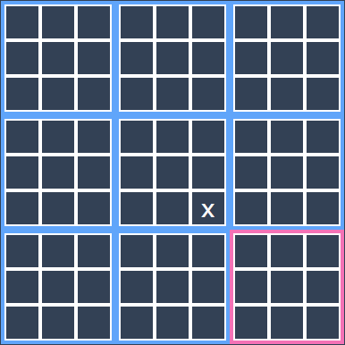
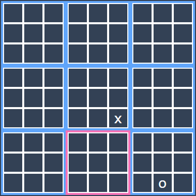
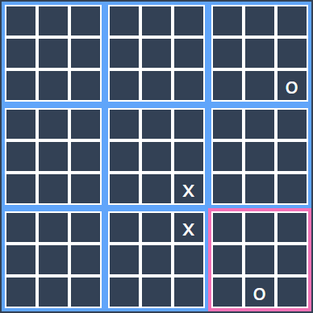

# Ultimate tic-tac-toe

A work in progress game made with SvelteKit.

The purpose of this project is to learn SvelteKit, since it looks quite nice.

## How to play

### Basics

Ultimate tic-tac-toe (or UTTT for short) is a game made out of 9 tic-tac-toe boards. Your objective is to win 3 tic-tac-toe boards in a row. 

### Terminology

Some terminology that will be used to explain the game:
- **Board**: an individual tic-tac-toe board.
- **Square**: a tile/square from a board.
- **Free move**: you get to choose which board and square to play.

### Rules

The first movement is free, which means player 1 can play on whatever board and square he wants. After that, the next board to play on is decided by the previous player's move. Whichever square your opponent picks, your next move will have to be on the corresponding board. 

For example, if player 1 played on a bottom-right square, your next move will have to be on the bottom-right board:

1. X plays center board, bottom right square:

    

2. O has to play on the bottom right board:

    

3. X plays top-right square, then O plays bottom-right:

    

This continues until someone wins 3 boards in a row.

**What happens when someone has to play on a board that's already been won?**

They get a free move.

## Additional sources:

- [Math with bad drawings: Ultimate tic-tac-toe](https://mathwithbaddrawings.com/2013/06/16/ultimate-tic-tac-toe/): A good explanation of the game with **good** drawings.

- [Wikipedia](https://en.wikipedia.org/wiki/Ultimate_tic-tac-toe): for a more in depth explaination of the game.